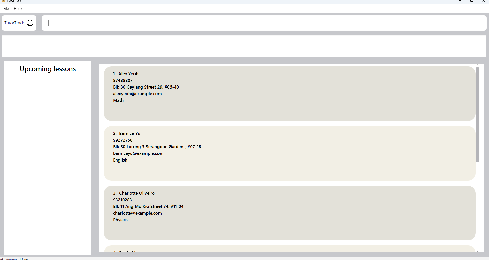
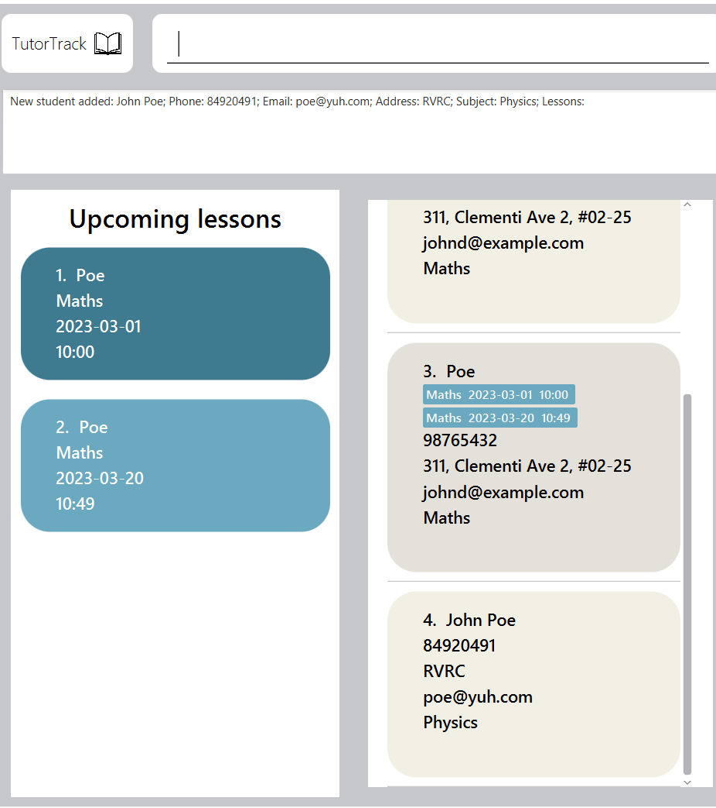
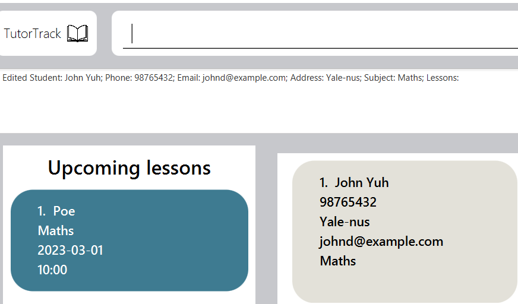
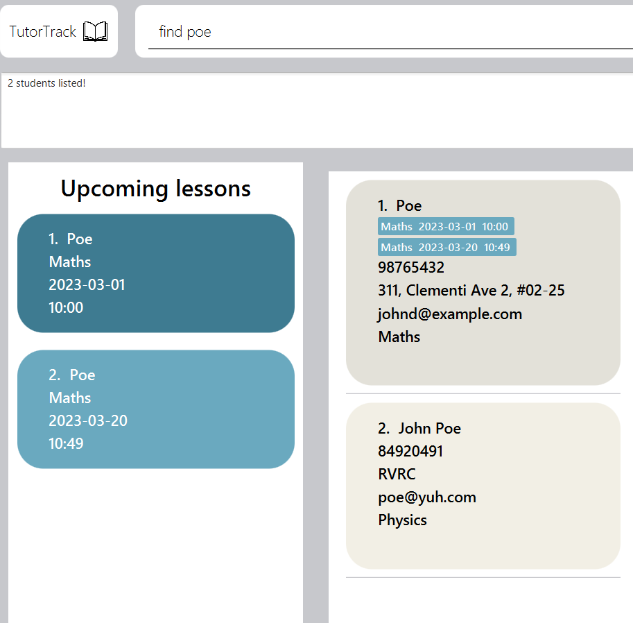

# _Tutor Track User Guide_ 
******

Tutor Track is a **desktop application for tutors to manage their students and scheduled classes, optimized for use via a 
Command Line Interface** (CLI) while still having the benefits of a Graphical User Interface (GUI). If you can type 
fast, TutorTrack can get your contact management tasks done faster than traditional GUI apps.

## How to use this guide
********
**Navigation** :  Use the table of contents to find the section you are looking for.  

**Features** : Each feature and what it does is listed with its respective command for you to understand what Tutor 
Track can do. 

**Examples** : Under each feature, examples of commands and UI are given for you to better understand how Tutor Track
works. 

**Getting started** : For first time users, refer to the "Quick start" segment to start up Tutor Track for the first
time.

## What is in this User Guide:
*********
- [Quick start](#quick-start)
- [Features](#features)
  - [`Help` : Viewing help](#viewing-help--help)
  - [`Add` : Adding a student](#adding-a-student-add)
  - [`List` : Listing all students](#listing-all-students--list)
  - [`Edit` : Editing a student](#editing-a-student--edit)
  - [`Find` : Finding a student](#locating-students-by-name-find)
  - [`Delete` : Deleting a student](#deleting-a-student--delete)
  - [`Schedule`: Adding a lesson schedule to a student](#add-a-lessson-schedule--schedule)
  - [`Mark`: Marking a lesson as done](#mark-a-lessson-schedule--mark)
  - [`Remark`: Add remark to a student](#add-remark-to-a-student--remark)
  - [`Fee status`: Add a fee status for a student](#add-a-fee-status-for-a-student-feestatus)
  - [`Left-click`: View a particular student's lessons](#viewing-a-particular-students-lesson--mouse-click)
  - [`Clear` : Clearing all entries](#clearing-all-entries--clear) 
  - [`Exit` : Exiting the program](#exiting-the-program--exit)
  - [Saving data](#saving-the-data)
  - [Editing the data file](#editing-the-data-file)
- [FAQs](#faq)
- [Known issues](#known-issues)
- [Command summary](#command-summary)

------

## Quick start

1. Ensure you have Java `11` or above installed in your Computer.

2. Download the latest `TutorTrack.jar` from [here](https://github.com/AY2324S2-CS2103T-T16-4/tp/releases).

3. Copy the file to the folder you want to use as the _home folder_ for your TutorTrack.

4. Open a command terminal, `cd` into the folder you put the jar file in, and use the `java -jar TutorTrack.jar` 
command to run the application. 
   A GUI similar to the below should appear in a few seconds. Note how the app contains some sample data. 
   

5. Type the command in the command box and press Enter to execute it. e.g. typing **`help`** and pressing Enter will 
open the help window. 
   
Here are some example commands you can try:

   * `list` : Lists all students.

   * `add n/John Doe p/98765432 e/johnd@example.com a/John street, block 123, #01-01 s/Maths` : Adds a student named 
`John Doe` to Tutor Track.

   * `delete 3` : Deletes the 3rd student shown in the current list.

   * `clear` : Deletes all students.

   * `exit` : Exits the Tutor Track application.

1. Refer to the [Features](#features) below for the details of each command.

--------------------------------------------------------------------------------------------------------------------

## Features

<box type="info" seamless>

**Notes about the command format:** 

* Words in `UPPER_CASE` are the parameters to be supplied by the user. 
  e.g. in `add n/NAME`, `NAME` is a parameter which can be used as `add n/John Doe`.

* Items in square brackets are optional. 
  e.g `n/NAME [l/LESSON]` can be used as `n/John Doe l/2024-05-01|09:00` or as `n/John Doe`.

* Items with `…`​ after them can be used multiple times including zero times. 
  e.g. `[l/LESSON]…​` can be used as ` ` (i.e. 0 times), `l/2024-05-01|09:00`, `l/Maths|2024-05-03|10:30 
* l/Biology|2024-05-05|11:00` etc.

* Parameters can be in any order. 
  e.g. if the command specifies `n/NAME p/PHONE_NUMBER`, `p/PHONE_NUMBER n/NAME` is also acceptable.

* Extraneous parameters for commands that do not take in parameters (such as `help`, `list`, `exit` and `clear`) will 
be ignored. 
  e.g. if the command specifies `help 123`, it will be interpreted as `help`.

* If you are using a PDF version of this document, be careful when copying and pasting commands that span multiple 
lines as space characters surrounding line-breaks may be omitted when copied over to the application.
</box>

### Viewing help : `help`

Shows a message with a link to access the help page.

Format: `help`

### Adding a Student: `add`

Adds a student to the address book.

Format: `add n/NAME p/PHONE_NUMBER e/EMAIL a/ADDRESS s/SUBJECT [l/LESSON]…​`

<box type="tip" seamless>

**Tip:** A student can have any number of lessons (including 0)
</box>

* `NAME` can be alphanumeric with spaces, and should not contain any special characters.  
* `NAME` should be unique.  
* Note that "John Doe" would be considered different from "john doe" i.e. capitalisation renders names unique.  
* `PHONE_NUMBER` can be any sequence of digits of any length.
* `EMAIL` must contain the username and domain of the email.
* `SUBJECT` must be alphabetic.
* `[LESSON]` must be in the format of `dd-mm-yyyy|hh:mm` e.g. `l/09-09-2024|10:00`

Examples:
* `add n/John Poe p/84920491 e/poe@yuh.com a/RVRC s/Physics`

### Listing all Students : `list`

Shows a list of all students in the address book.

Format: `list`

### Editing a Student : `edit`

Edits an existing student in the address book.

Format: `edit INDEX [n/NAME] [p/PHONE] [e/EMAIL] [a/ADDRESS] [s/SUBJECT]…​`

* Edits the student at the specified `INDEX`. The index refers to the index number shown in the displayed student list. 
The index **must be a positive integer** 1, 2, 3, …​
* At least one of the optional fields must be provided.
* Existing values will be updated to the input values.
* When editing lessons, the existing lessons of the student will be removed i.e adding of lessons is not cumulative.
* You can remove all the person’s lessons by typing `l/` without specifying any lessons after it.

Example:
*  `edit 1 a/Yale-nus l/` Edits the address of the first person to be `Yale-nus` and clears all existing lessons.

### Locating students by name: `find`

Finds persons whose names contain any of the given keywords.

Format: `find KEYWORD [MORE_KEYWORDS]`

* The search is case-insensitive i.e. `hans` will match `Hans`
* The order of the keywords does not matter. e.g. `Hans Bo` will match `Bo Hans`
* Only the name is searched.
* Only full words will be matched e.g. `Han` will not match `Hans`
* Students matching at least one keyword will be returned (i.e. `OR` search).
  e.g. `Hans Bo` will return `Hans Gruber`, `Bo Yang`

Examples:
* `find poe` returns `Poe` `John Poe`  

### Deleting a Student : `delete`

Deletes the specified person from the address book.

Format: `delete INDEX`

* Deletes the person at the specified `INDEX`.
* The index refers to the index number shown in the displayed person list.
* The index **must be a positive integer** 1, 2, 3, …​

Examples:
* `list` followed by `delete 2` deletes the 2nd student in TutorTrack.
* `find Jessica Jane` followed by `delete 1` deletes the 1st person in the results of the `find` command.
* Note that upon deletion the full student list is not displayed, for which the `list` command has to be used.

### Add a lesson schedule : `schedule`

Adds a lesson to a specific student.

Format : `schedule INDEX l/LESSON`

* Adds a lesson to the specified `INDEX`.
* `INDEX` **must be a positive integer** 1, 2, 3, ...
* `INDEX` refers to the index number shown in the displayed person list.
* `LESSON` must be in the format of `dd-mm-yyyy|hh:mm` 

Examples:
* `schedule 1 l/09-09-2024|10:00` would add a new lesson at 09-09-2024, 10:00 to the first person on the student list.

### Mark a lesson schedule : `mark`

Mark a lesson as complete to a specific student and removing it from displaying.

Format : `mark INDEX l/LESSON`

* Marks a lesson at the specified `INDEX`.
* `INDEX` **must be a positive integer** 1, 2, 3, ...
* `INDEX` refers to the index number shown in the displayed person list.
* `LESSON` must be in the format of `dd-mm-yyyy|hh:mm`.
* Completed lessons will not show up in the list of lessons for the student.

Example:
* `mark 1 l/09-09-2024|10:00` would mark a lesson at 09-09-2024, 10:00 as completed to the first person on the student list.

### Add remark to a student : `remark`

Format : `remark INDEX r/REMARK`

* Adds a remark to a student by specifying the `INDEX`.
* `INDEX` **must be a positive integer** 1, 2, 3, ...
* `INDEX` refers to the index number shown in the displayed person list.

Example:
* `remark 1 r/Student is very hardworking` would add a remark to the first student on the student list.

### Add a fee status for a student: `feestatus`

Format: `feeststatus INDEX f/FEE_STATUS`

* Adds a simple tag of a fee status to a student at the specified `INDEX`.
* `INDEX` **must be a positive integer** 1, 2, 3, ...
* `INDEX` refers to the index number shown in the displayed person list.
* `FEE_STATUS` can be alphanumeric for flexibility for the tutor.

Example:
*`feestatus 1 f/Will make payment via paynow within next 3 days`

### Viewing a particular student's lesson : `left-click`

Simply left-click on the particular student to view his/her lessons on chronological order

### Clearing all entries : `clear`

Clears all entries from TutorTrack.

Format: `clear`

### Exiting the program : `exit`

Exits the program.

Format: `exit`

### Saving the data

TutorTrack data are saved in the hard disk automatically after any command that changes the data. 
There is no need to save manually.

### Editing the data file

TutorTrack data are saved automatically as a JSON file `[JAR file location]/data/addressbook.json`. 
Advanced users are welcome to update data directly by editing that data file.

<box type="warning" seamless>

**Caution:**
If your changes to the data file makes its format invalid, TutorTrack will discard all data and start with an empty 
data file at the next run.  Hence, it is recommended to take a backup of the file before editing it. 
Furthermore, certain edits can cause the AddressBook to behave in unexpected ways (e.g., if a value entered is outside 
the acceptable range). Therefore, edit the data file only if you are confident that you can update it correctly.
</box>

--------------------------------------------------------------------------------------------------------------------

## FAQ

**Q**: How do I transfer my data to another Computer? 
**A**: Install the app in the other computer and overwrite the empty data file it creates with the file that contains 
the data of your previous Tutor Track home folder.

--------------------------------------------------------------------------------------------------------------------

## Known issues

1. **When using multiple screens**, if you move the application to a secondary screen, and later switch to using only 
the primary screen, the GUI will open off-screen. The remedy is to delete the `preferences.json` file created by the 
application before running the application again.

--------------------------------------------------------------------------------------------------------------------

## Command summary

 Action         | Format, Examples                                                                                                                                                                                  
----------------|---------------------------------------------------------------------------------------------------------------------------------------------------------------------------------------------------
 **Add**        | `add n/NAME p/PHONE_NUMBER e/EMAIL a/ADDRESS s/SUBJECT [l/LESSON]…​`   e.g., `add n/James Ho p/22224444 e/jamesho@example.com a/123, Clementi Rd, 1234665 s/Maths l/Maths \|2024-05-03\|10:30` 
 **Clear**      | `clear`                                                                                                                                                                                           
 **Delete**     | `delete INDEX`  e.g., `delete 3`                                                                                                                                                               
 **Edit**       | `edit INDEX [n/NAME] [p/PHONE_NUMBER] [e/EMAIL] [a/ADDRESS] [l/LESSON]…​`  e.g.,`edit 2 n/James Lee e/jameslee@example.com`                                                                    
 **Fee Status** | `feestatus INDEX f/FEESTATUS`   e.g. `feestatus 1 f/To pay within next 3 days via paynow`                                                                                                                                                                    
 **Find**       | `find KEYWORD [MORE_KEYWORDS]`  e.g., `find James Jake`                                                                                                                                        
 **Remark**     | `remark INDEX r/REMARK`   e.g., `remark 1 r/Needs extra practice`                                                                                                                              
 **Schedule**   | `schedule INDEX l/LESSON`   e.g., `schedule 1 l/ 20-05-2024\|10:30`                                                                                                                            
 **Mark**       | `mark INDEX l/LESSON`   e.g. `mark 1 l/09-09-2024\|10:00`                                                                                                                                      
 **List**       | `list`                                                                                                                                                                                            
 **Help**       | `help`                                                                                                                                                                                            
 **Exit**       | `exit`                                                                                                                                                                                            

